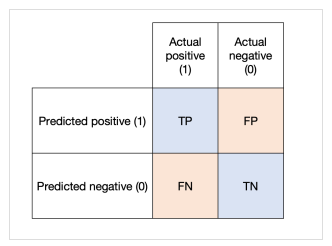
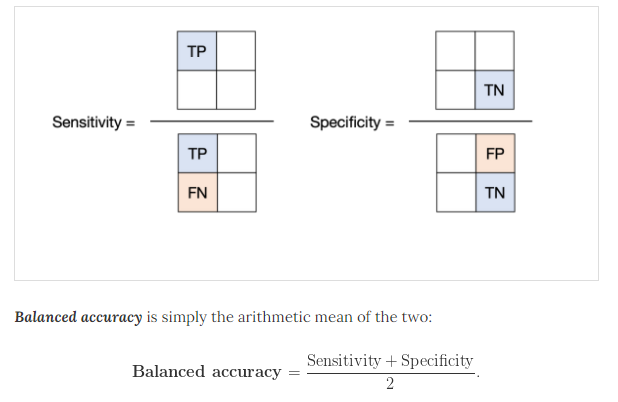
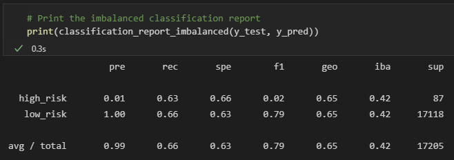
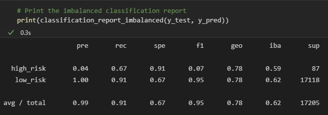

# Credit Risk Analysis

## Overview

Using the credit card credit data set from LendingClub, a peer-to-peer lending services company, we are tasked with oversampling the data using the RandomOverSample and MSOTE algorithms, and undersample the data using the ClusterCentrods algorithm. Then, you’ll use a combinatorial approach of over- and undersampling using the SMOTEENN algorithm. Next, you’ll compare two new machine learning models that reduce bias, BalancedRandomForestClassifier and EasyEnsembleClassifier, to predict credit risk. Once you’re done, you’ll evaluate the performance of these models and make a written recommendation on whether they should be used to predict credit risk.

## Results

To predict the credit risk of the data, we will use 6 different models. For each of the models, we will evaluate the results. The results for each model below are the balanced accuracy score, the precision and the recall. The balanced accuracy score is found by adding the sensitivity and the specificity together and dividing by 2. Sensitivity is number of True Positive results divided by the True Positive and False Negative results added together. The specificity score is the number of True Negative results divided by the number of False Positives plus the True Negatives. (See image below for more explanation.) 

Balanced accuracy is a metric that one can use when evaluating how good a binary classifier is. It is especially useful when the classes are imbalanced, i.e. one of the two classes appears a lot more often than the other. This happens often in many settings such as anomaly detection and the presence of a disease.

Recall and Precision and found in very similar ways to sensitivity and specificity. 
Recall answers what proportion of actual positive responses were identified correctly. 
Precision answers what proportion of positive identifications were actually correct. 

1.) Oversampling - Naive Random Oversampling

2.) SMOTE Oversampling

3.) Undersampling

4.) Combination Sampling

5.) Balanced Random Forest Classifier

6.) Easy Ensemble AdaBoost Classifier

## Summary

