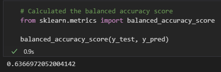
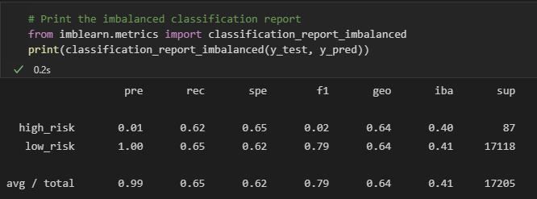
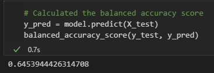
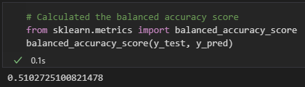
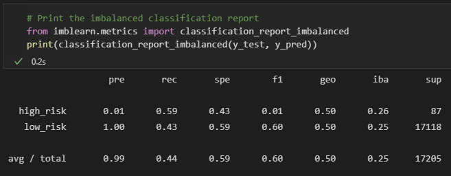
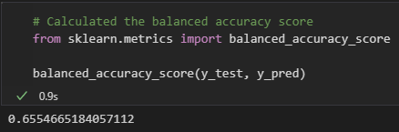
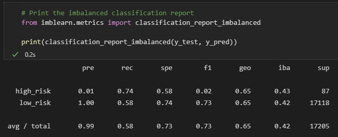
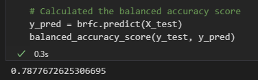
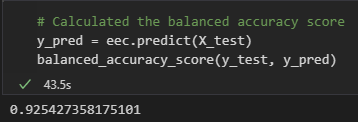
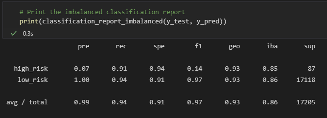

# Credit Risk Analysis

## Overview

Using the credit card credit data set from LendingClub, a peer-to-peer lending services company, we are tasked with oversampling the data using the RandomOverSample and MSOTE algorithms, and undersample the data using the ClusterCentrods algorithm. Then, you’ll use a combinatorial approach of over- and undersampling using the SMOTEENN algorithm. Next, you’ll compare two new machine learning models that reduce bias, BalancedRandomForestClassifier and EasyEnsembleClassifier, to predict credit risk. Once you’re done, you’ll evaluate the performance of these models and make a written recommendation on whether they should be used to predict credit risk.

## Results

1.) Oversampling - Naive Random Oversampling

2.) SMOTE Oversampling

3.) Undersampling

4.) Combination Sampling

5.) Balanced Random Forest Classifier

6.) Easy Ensemble AdaBoost Classifier

## Summary

